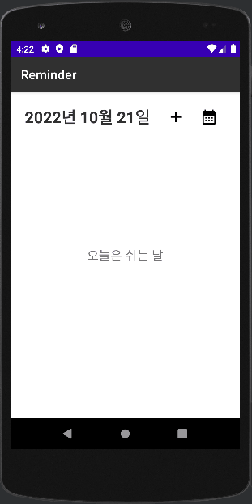
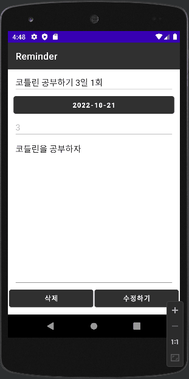
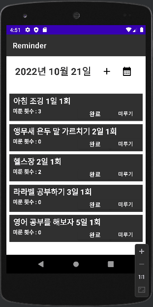
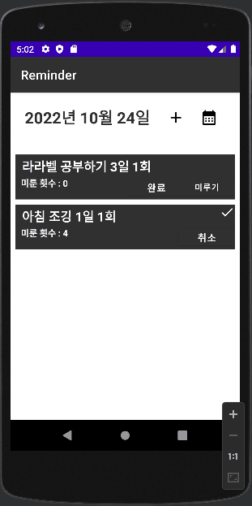

# Reminder를 만들자! with Kotlin 😊

- 작업기간 : 3주  
- 사용언어 : 코틀린, Room(SQLite)  
- Andorid : 5.1 Lollipop

### 만들게된 계기
습관 만들려고 할 때 이틀에 한 번, 사흘에 한 번, 나흘에 한 번과 같이 일정한 주기를 정해놓는 경우가 많았다. 

습관이 하나면 괜찮지만 여러 개 일 경우 이들의 날짜 계산이 까다로워졌다. 
개발자는 직접 문제를 해결할 수 있는 사람인 법   

직접 만들기로 했다

겸사겸사 코틀린이 재밌어 보여 코틀린으로 개발했다.

### 그래서 뭐냐 🙄

- 습관을 저장해서 주기마다 확인이 가능하다!  
 
- 습관은 바뀌는 법, 수정 및 삭제도 가능하다!  
 
- 오늘도 바쁘게 살아온 나를 위해 하루 정도는 미룰 수도 있다..!  
 
- 캘린더 화면으로 전체 일정 및 지난 행적을 확인할 수 있다!  
 

### 성가시게 했던 점
- 미루거나 주기를 수정했을 때 할 일을 완료되었던 날들의 기록은 어떻게 처리하지?
  - expired_at 컬럼으로 만료 기간을 저장해 이전에 완료했다는 기록을 남긴 채 하루를 미룰 수 있었습니다.   
- ViewModel 를 생성할 때 일반적인 방법으로 매개변수를 넘길 수가 없네?
  - ViewModelFactory 기능을 사용해 ViewModel 에 성공적으로 값을 넘겨 달력 기능을 만들 수 있었습니다. 
- Activity 에서 바로 room 의 데이터 사용시 에러가 발생
  - UI 쓰레드에서는 딜레이가 걸리는 작업을 할 수 없음, 별도의 쓰레드로 해결한다. 
- 데이터 변경시 RecyclerView 에 바로 적용을 어떻게 하지?
  - 리사이클뷰를 업데이트해야하는 상황이 올 경우 페이지리를 리로딩해버리자. (실제 폰에서 부드럽게 움직임)
  - 추후에 쓰레드로 바꿀 것

### 고도화
- 2022-11-08 : 할일 알람 기능 및 알람 시간 설정 기능 추가 
- 2022-11-08 : 작일에 하지 못한 할일에 대한 자동 미루기 기능 추가