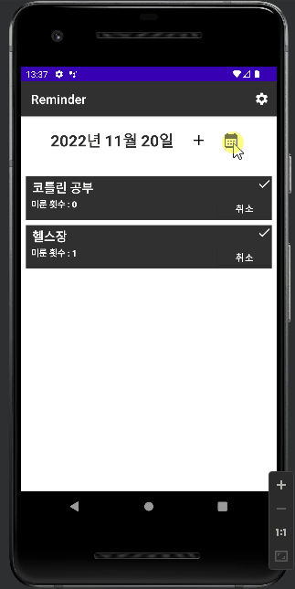

# Reminder를 만들자! with Kotlin 😊

- 작업기간 : 4주  
- 사용언어 : 코틀린, Room(SQLite)  
- Andorid : 5.1 Lollipop
 

## 차례
- [배경](https://github.com/DSeung001/Reminder#%EB%B0%B0%EA%B2%BD)
- [Reminder란](https://github.com/DSeung001/Reminder#Reminder%EB%9E%80)
- [성가시게 했던 점](https://github.com/DSeung001/Reminder#%EC%84%B1%EA%B0%80%EC%8B%9C%EA%B2%8C-%ED%96%88%EB%8D%98-%EC%A0%90)
- [고도화](https://github.com/DSeung001/Reminder#%EA%B3%A0%EB%8F%84%ED%99%94)
 

## 배경
습관 만들려고 할 때 이틀에 한 번, 사흘에 한 번, 나흘에 한 번과 같이 일정한 주기를 정해놓는 경우가 많았다. 

습관이 하나면 괜찮지만 여러 개일 경우 이들의 날짜 계산이 까다로워졌다. 
개발자는 직접 문제를 해결할 수 있는 사람인 법   

직접 만들기로 했다

겸사겸사 코틀린이 재밌어 보여 코틀린으로 개발했다.
 
 

## Reminder란

 

### 습관을 저장해서 주기마다 확인이 가능하다!  

 

### 습관은 바뀌는 법, 수정 및 삭제도 가능하다!  

 

### 오늘도 바쁘게 살아온 나를 위해 하루 정도는 미룰 수도 있다..!  

 

### 캘린더 화면으로 전체 일정 및 지난 행적을 확인할 수 있다!  

 

### 설정을 통해 어제하지 못한 일을 내일로 자동적으로 미루거나 알림 시간을 정할 수 있다!  

 

### 매일 알림을 통해 오늘 할일이 몇개인지 알 수 있다!  

 
 

## 성가시게 했던 점
- 미루기 기능을 사용했을 때 할 일을 완료되었던 날들의 기록을 남긴 채로 어떻게 처리하지?
  - expired_at 컬럼으로 만료 기간을 저장해 이전에 완료했다는 기록을 남긴 채 하루를 미룰 수 있었습니다.   
- ViewModel 를 생성할 때 일반적인 방법으로 생성자로 매개변수를 넘길 수가 없네?
  - ViewModelFactory 기능을 사용해 ViewModel 에 성공적으로 값을 넘겨 달력 기능을 만들 수 있었습니다. 
- Activity 에서 바로 room 의 데이터를 사용 시 에러가 발생하네?
  - UI 스레드에서는 지연이 생기는 작업을 할 수 없음, 별도의 스레드를 사용해야 합니다.
- S22 울트라에서 자동 꺼짐 현상이 발생하네?
  - 안드로이드 12 버전 이후 부터는 PendingIntent.FLAG_IMMUTABLE 설정이 필수이므로 플래그 수정했습니다.
- 캘린더의 각 날짜에서 몇 개의 일이 있는 지 표시하고 싶은데 기본 캘린더로는 방법이 없고, 라이브러리를 사용하자니 관련 리소스를 못 찾았네?
  - 해당 라이브러리에서 관련 리소스가 없었지만 지금까지 배운 방법을 토대로 하나하나 테스트 해보며 방법을 만들었습니다.
  - url : https://github.com/prolificinteractive/material-calendarview
 
 

## 고도화
- 2022-11-08 : 오늘 해야할 일이 몇 개인지 알려주는 알림 기능 추가 및 알림에 대한 시간 설정 기능 추가
- 2022-11-08 : 작일에 하지 못한 일에 대해서 자동적으로 미루기가 되게하는 설정 기능 추가 
- 2022-11-16 : 달력 페이지에서 이번 달 각 날짜에 해야할 일의 개수를 표시(더 다듬은 후 Readme 수정) 